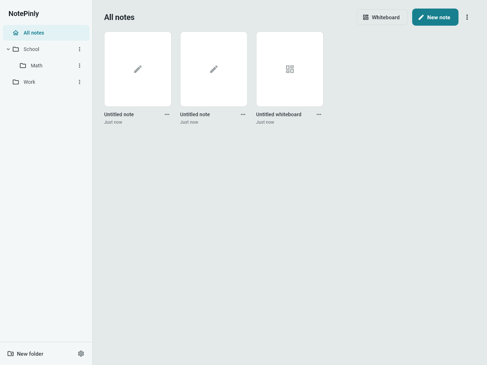
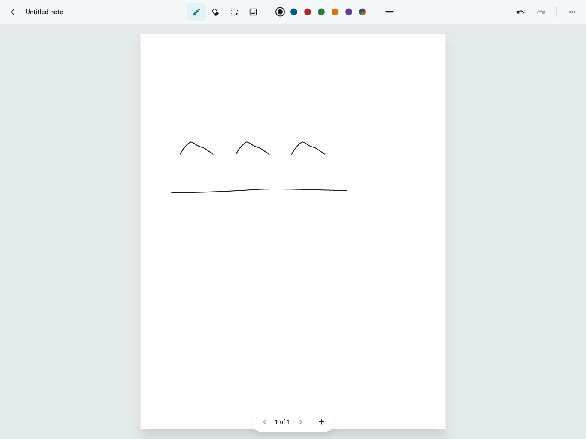
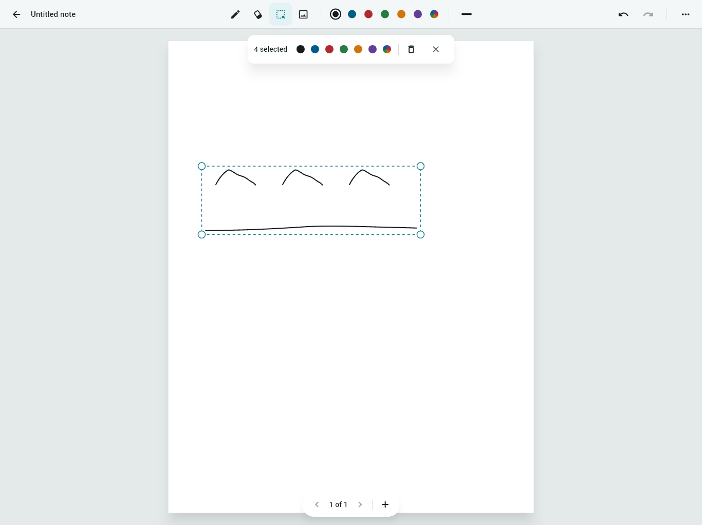
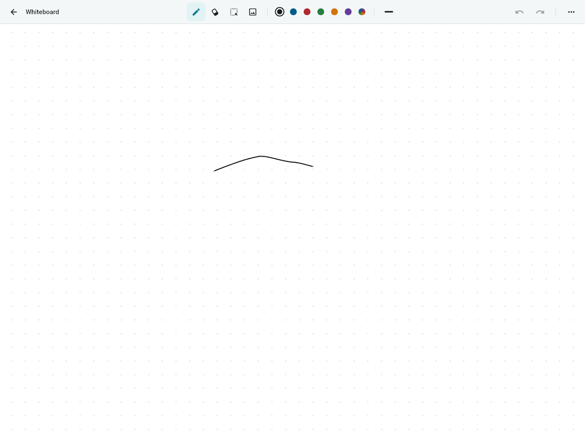

<div align="center">


# NotePinly

**Handwriting notes that feel like good stationery.**

A cross-platform handwriting note-taking app built with Flutter — pressure-sensitive ink, palm rejection, PDF annotation, and an infinite whiteboard. All data stays local and offline: no accounts, no sync setup, no save buttons.

</div>

---

## Screenshots

| Library | Editor |
|---|---|
|  |  |

| Lasso selection | Whiteboard |
|---|---|
|  |  |

## Features

- **Low-latency inking** — pressure- and tilt-aware strokes with one-euro smoothing, Catmull-Rom interpolation, and stroke-tip prediction
- **Palm rejection** — only the stylus draws; fingers always pan (one finger) and zoom (two fingers)
- **Dual-mode eraser** — erase whole strokes, or split strokes mid-line (area mode)
- **Lasso select** — move, resize, recolor, or delete any selection
- **Pages & paper templates** — blank, lined, grid, and dotted paper; per-page rotation
- **PDF & image import** — annotate PDFs page-by-page, drop in photos from camera or gallery
- **Infinite whiteboard** — an unbounded canvas alongside paged notes
- **Folders & library** — nested folders with a sidebar tree and note thumbnails
- **Invisible auto-save** — every operation is journaled immediately and crash-safe; worst-case loss is the stroke in progress
- **Undo/redo** — full per-note command history

## Getting started

Requires the [Flutter SDK](https://docs.flutter.dev/get-started/install) (Dart `^3.12.1`).

```sh
git clone <repo-url>
cd notepinly
flutter pub get
flutter run            # add -d windows / -d chrome / -d <device> to pick a target
```

### Useful commands

```sh
flutter analyze                      # static analysis
flutter test                         # run all tests
flutter test --update-goldens test/preview/editor_preview_test.dart   # refresh UI goldens
flutter build apk                    # Android (also: appbundle, ios, web, windows, macos)
dart run build_runner build          # regenerate drift database code
dart run flutter_launcher_icons      # regenerate app icons from assets/logo.png
```

## Architecture

Three layers, with blocs depending on domain repositories only:

```
lib/
  presentation/   widgets + blocs (flutter_bloc), routing (go_router)
  domain/         entities + repository interfaces (pure Dart)
  data/           repository implementations, drift database, note file store
```

Strokes are vector-only and stored in page-local logical coordinates. The high-frequency drawing path bypasses bloc entirely: live points repaint a single canvas layer per frame, and only the finished stroke is dispatched to state. Notes persist as a `content.json` snapshot plus an append-only journal for crash safety; folder/note metadata lives in SQLite via drift.

See [ARCHITECTURE.md](ARCHITECTURE.md) for the full design and [PRODUCT.md](PRODUCT.md) for product principles.

## CI/CD

- **[CI](.github/workflows/ci.yml)** — runs `flutter analyze` and the full test suite on every push and pull request to `master`. Tests run on a Windows runner because the golden screenshots are recorded on Windows.
- **[Release](.github/workflows/release.yml)** — pushing a tag like `v1.0.0` builds the Android APK, Windows bundle, and web bundle, then publishes them to a GitHub Release:

```sh
git tag v1.0.0
git push origin v1.0.0
```

## Testing

The suite covers the inking engine (smoothing, ribbon geometry, camera math), eraser and lasso hit-testing, stroke serialization, save/load with journal replay, bloc behavior, and golden-based UI previews under `test/preview/`.

```sh
flutter test                          # everything
flutter test test/engine_test.dart    # one file
flutter test --plain-name "<name>"    # one test
```
